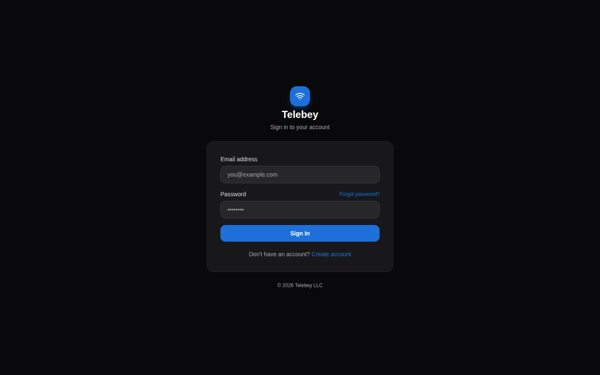
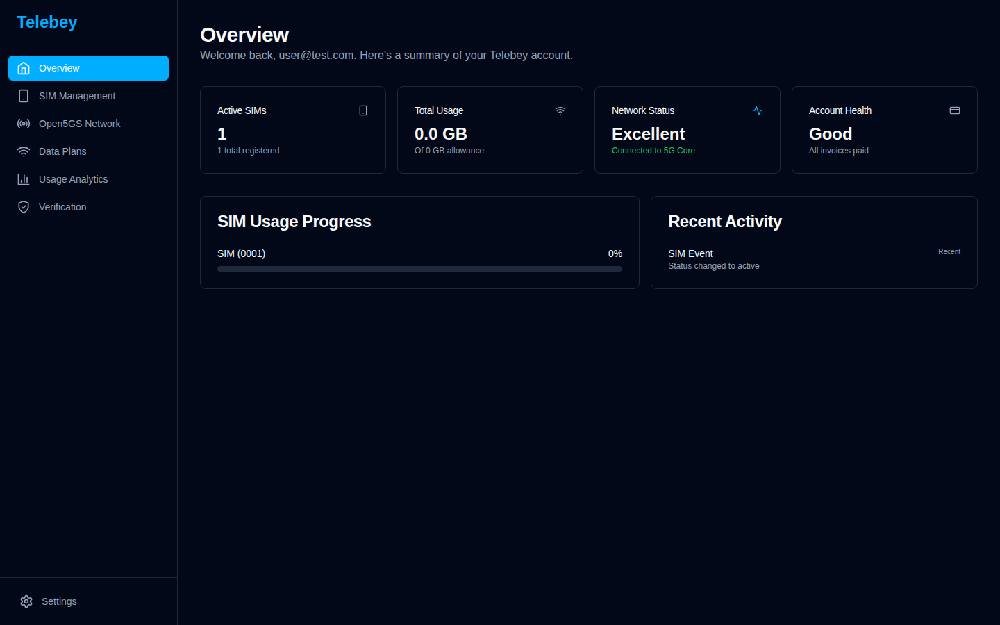
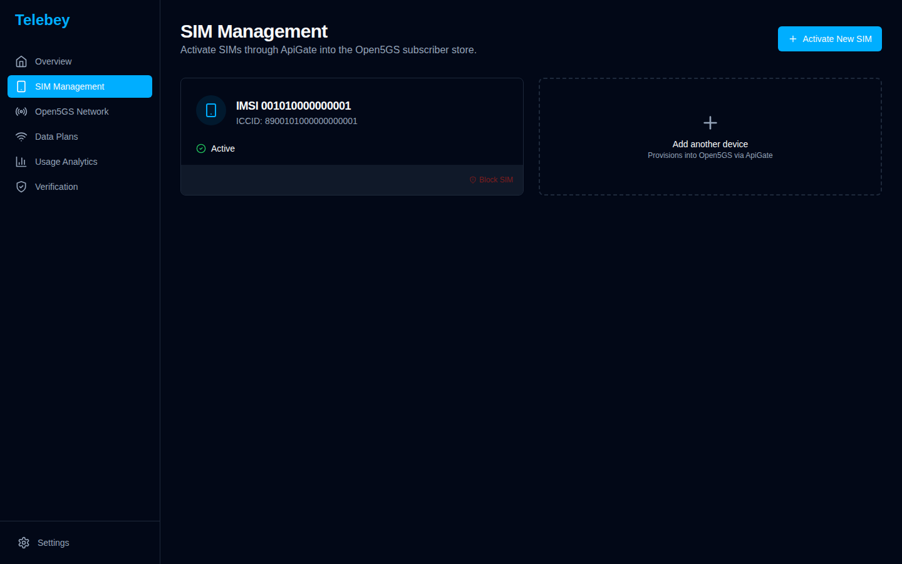
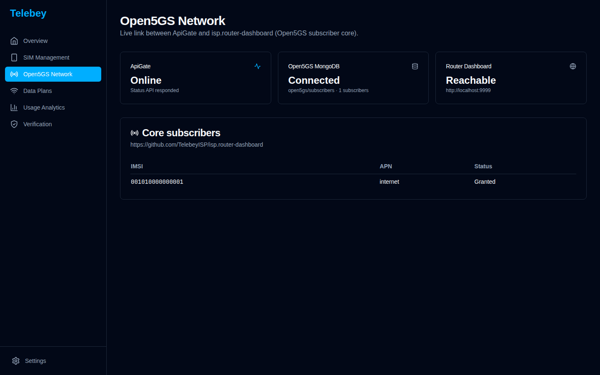
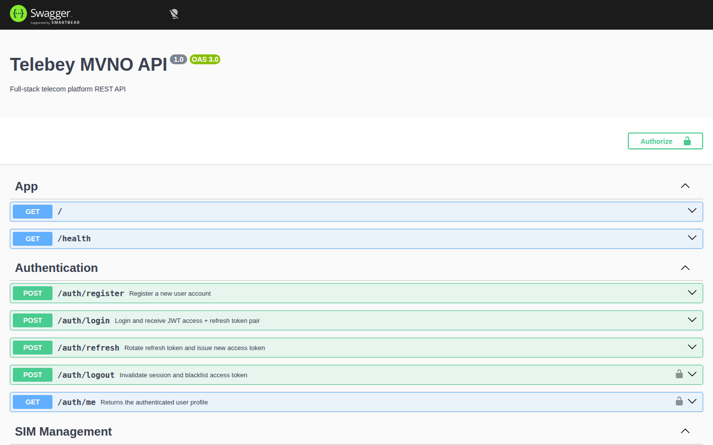
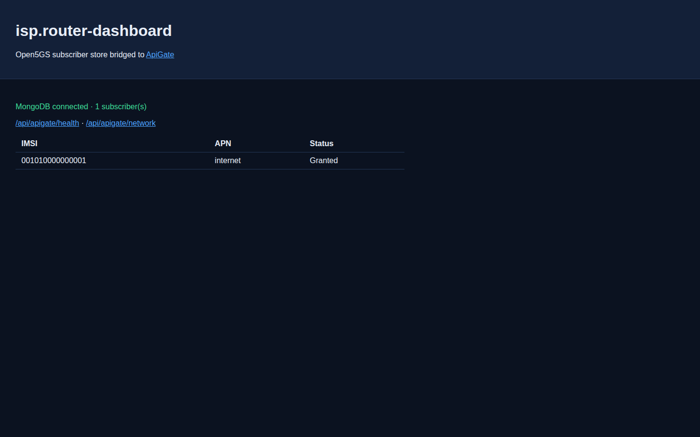
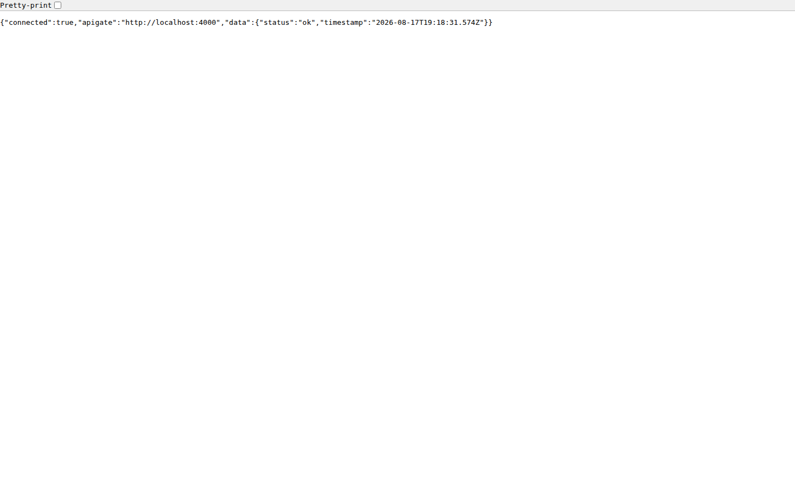

# Telebey ApiGate

ApiGate is the Telebey MVNO REST API. This branch connects it to
[isp.router-dashboard](https://github.com/TelebeyISP/isp.router-dashboard)
(Open5GS WebUI + subscriber core) so the dashboard and the 5G network share one
subscriber store.

## Architecture

```
Telebey Dashboard :3000  →  ApiGate :4000  →  Open5GS MongoDB (open5gs.subscribers)
                                ↑                    ↑
                     /api/apigate/*            isp.router-dashboard WebUI :9999
```

- Activating a SIM in the Telebey dashboard calls `POST /sim/activate`.
- ApiGate writes an Open5GS subscriber document (IMSI, K, OPc, APN `internet`).
- The Open5GS WebUI reads the same MongoDB collection.
- The WebUI exposes `GET /api/apigate/health` and `GET /api/apigate/network`
  so the router dashboard can reach ApiGate.

## Quick start

Clone both repositories as siblings (or let Compose build the WebUI from GitHub):

```bash
git clone https://github.com/TelebeyISP/ApiGate.git
git clone https://github.com/TelebeyISP/isp.router-dashboard.git
cd ApiGate
cp .env.example .env
./scripts/dev-stack.sh
```

| Service | URL |
| --- | --- |
| Telebey dashboard | http://localhost:3000 |
| ApiGate + Swagger | http://localhost:4000/api/docs |
| Open5GS WebUI | http://localhost:9999 |
| Open5GS network status | http://localhost:4000/open5gs/status |
| WebUI → ApiGate bridge | http://localhost:9999/api/apigate/health |

Demo login (after seed): `user@test.com` / `Test1234!`  
Open5GS WebUI (dev): `admin` / `1423`

## Verify the link

```bash
./scripts/test-open5gs-apigate.sh
```

The script checks ApiGate health, Open5GS MongoDB connectivity, the WebUI
bridge, login, SIM activate, and that the IMSI exists in the Open5GS
subscriber collection.

## Local development without Compose

```bash
# infra
docker compose up -d postgres redis mongo open5gs-webui

# API
cp .env.example .env
cd telebey-platform/apps/api && npm install && npm run seed && npm run start:dev

# dashboard
cd telebey-platform/apps/telebey-dashboard
echo 'NEXT_PUBLIC_API_URL=http://localhost:4000' > .env.local
npm install && npm run dev
```

## Screenshots

Login against a live ApiGate session:



Overview after SIMs are loaded from `/sim`:



SIM activate writes the IMSI into Open5GS:



Network page showing MongoDB + WebUI health:



ApiGate Swagger (`/api/docs`) with Open5GS routes:



Open5GS WebUI bridged to ApiGate:



WebUI reverse call into ApiGate:



## Walkthrough video

<video src="docs/media/apigate-open5gs-walkthrough.mp4" controls width="800"></video>

[Download the walkthrough](docs/media/apigate-open5gs-walkthrough.mp4)

The recording covers dashboard login, SIM provision into Open5GS, the network
status page, Swagger, and the WebUI `/api/apigate/health` bridge.

## API surface added for Open5GS

| Method | Path | Auth | Purpose |
| --- | --- | --- | --- |
| GET | `/health` | no | ApiGate liveness |
| GET | `/open5gs/status` | no | MongoDB + WebUI probe |
| GET | `/open5gs/subscribers` | JWT | List core IMSIs |
| GET | `/open5gs/subscribers/:imsi` | JWT | Fetch one subscriber |
| POST | `/sim/activate` | JWT | Create SIM **and** Open5GS subscriber |
| POST | `/sim/block/:id` | JWT | Bar the SIM in Postgres and Open5GS |

## Reverse connection (isp.router-dashboard → ApiGate)

Overlay files live in `integrations/isp-router-dashboard/` and are mounted into
the WebUI container. The same files are intended for
[isp.router-dashboard](https://github.com/TelebeyISP/isp.router-dashboard):

- `webui/server/routes/apigate.js` — proxies `/api/apigate/*` to ApiGate
- `webui/server/routes/index.js` — mounts the bridge
- `webui/server/index.js` — binds `0.0.0.0` and CSRF-exempts the bridge
- `docker-compose.apigate.yml` — sets `APIGATE_URL`

```bash
cd isp.router-dashboard
APIGATE_URL=http://host.docker.internal:4000 docker compose -f docker/docker-compose.yml -f docker-compose.apigate.yml up webui
```
